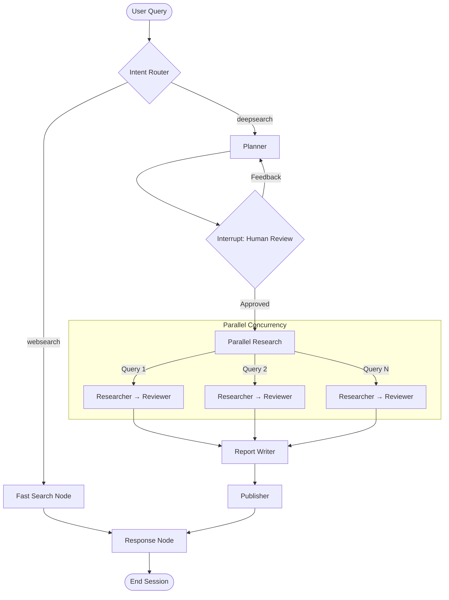

# 🔍 WORT - Complete Project Architecture

> A Full-Stack AI Research Agent: Research Planning → Execution → Report Generation

---

## 📋 Project Overview

**WORT** (Web Orchestrated Research Tool) is a high-performance, full-stack AI research platform. The system operates on three main pillars:
1. **Agent Engine (`deep-research-agent`)**: A LangGraph-based asynchronous state machine that plans, researches concurrently, and synthesizes long-form reports.
2. **Backend Server (`server`)**: A FastAPI application that serves as the bridge, managing persistent WebSocket connections and aggressively routing LangGraph streams down to the client.
3. **Frontend (`FrontEnd/wort-ai-core`)**: A React/Vite interface providing a transparent, real-time window into the agent's "brain" via live token streaming and progress bars.

---

## 🔗 The Grand Integration: How Things Connect

The most critical part of WORT is the **Real-time Streaming Pipeline** that connects the Agent, the Server, and the Frontend.

### 1. The Request Flow
- **Frontend (`useChat.ts`)**: The user submits a query. The `sendMessage` function sends a JSON payload `{ type: "start", input: "...", mode: "..." }` over the WebSocket.
- **Backend (`websocket.py` & `stream_service.py`)**: The FastAPI server receives this. `StreamService._handle_start` loads memory context from Postgres (via `MemoryFacade`), builds the initial state, and invokes the LangGraph instance.

### 2. The Execution & Streaming Flow
- **Agent (`deep_research_agent.py`)**: The LangGraph nodes run, generating LLM tokens and custom progress events (`adispatch`).
- **Backend Router (`chunk_router.py`)**: The critical middleman. As LangGraph yields chunks, `ChunkRouter.route()` intercepts them, filters out noise, routes LLM tokens, and transforms node updates into state syncs.
- **Frontend Sync (`useChat.ts`)**: The WebSocket receives these structured chunks, updating React state instantly to render token streams and progress data (`<AgentProgress />`).

### 3. Human-in-the-Loop (HITL) Interrupts
- The **Agent** (`planner/plan.py`) yields an `interrupt()` to pause.
- **Backend** sends an `interrupt` event to the UI.
- **Frontend** surfaces a review modal. Upon approval, `useChat.resume(...)` sends a `resume` message.
- **Backend** wraps this in a LangGraph `Command(resume=...)`, injecting it back into the graph to resume work.

---

## 📁 Complete File Structure & Explanations

- **`FrontEnd/`**
  - **`wort-ai-core/`**
    - `.gitignore`: 
    - `README.md`: 
    - `bun.lockb`: 
    - `components.json`: 
    - `eslint.config.js`: 
    - `index.html`: 
    - `package-lock.json`: 
    - `package.json`: 
    - `postcss.config.js`: 
    - **`src/`**
      - `App.css`: 
      - `App.tsx`: 
      - **`components/`**
        - `AgentProgress.tsx`: 
        - `ChatInput.tsx`: 
        - `ChatWorkspace.tsx`: 
        - `NavLink.tsx`: 
        - **`Report_Viewer/`**
          - `ReportSection.tsx`: 
          - `ReportToolbar.tsx`: 
          - `ReportViewer.tsx`: 
          - `report-styles.css`: 
          - `types.ts`: 
        - `RichResponse.tsx`: 
        - `ThreadSidebar.tsx`: 
        - `ToolLog.tsx`: 
        - `WortHeader.tsx`: 
        - **`ui/`**
          - `accordion.tsx`: 
          - `alert-dialog.tsx`: 
          - `alert.tsx`: 
          - `aspect-ratio.tsx`: 
          - `avatar.tsx`: 
          - `badge.tsx`: 
          - `breadcrumb.tsx`: 
          - `button.tsx`: 
          - `calendar.tsx`: 
          - `card.tsx`: 
          - `carousel.tsx`: 
          - `chart.tsx`: 
          - `checkbox.tsx`: 
          - `collapsible.tsx`: 
          - `command.tsx`: 
          - `context-menu.tsx`: 
          - `dialog.tsx`: 
          - `drawer.tsx`: 
          - `dropdown-menu.tsx`: 
          - `form.tsx`: 
          - `hover-card.tsx`: 
          - `input-otp.tsx`: 
          - `input.tsx`: 
          - `label.tsx`: 
          - `menubar.tsx`: 
          - `navigation-menu.tsx`: 
          - `pagination.tsx`: 
          - `popover.tsx`: 
          - `progress.tsx`: 
          - `radio-group.tsx`: 
          - `resizable.tsx`: 
          - `scroll-area.tsx`: 
          - `select.tsx`: 
          - `separator.tsx`: 
          - `sheet.tsx`: 
          - `sidebar.tsx`: 
          - `skeleton.tsx`: 
          - `slider.tsx`: 
          - `sonner.tsx`: 
          - `switch.tsx`: 
          - `table.tsx`: 
          - `tabs.tsx`: 
          - `textarea.tsx`: 
          - `toast.tsx`: 
          - `toaster.tsx`: 
          - `toggle-group.tsx`: 
          - `toggle.tsx`: 
          - `tooltip.tsx`: 
          - `use-toast.ts`: 
      - **`hooks/`**
        - `use-mobile.tsx`: 
        - `use-toast.ts`: 
        - `useChat.ts`: 
        - `useWebSocket.ts`: 
      - `index.css`: 
      - **`lib/`**
        - `utils.ts`: 
      - `main.tsx`: 
      - **`pages/`**
        - `Index.tsx`: 
        - `NotFound.tsx`: 
      - **`test/`**
        - `example.test.ts`: 
        - `setup.ts`: 
      - `vite-env.d.ts`: 
    - `style.md`: 
    - `tailwind.config.ts`: 
    - `tsconfig.app.json`: 
    - `tsconfig.json`: 
    - `tsconfig.node.json`: 
    - `vite.config.ts`: 
    - `vitest.config.ts`: 
- **`deep-research-agent/`**
  - **`.agent/`**
    - **`rules/`**
      - `code-writing-rules.md`: 
  - `.env`: 
  - `.gitignore`: 
  - **`HITL/`**
    - `__init__.py`: 
    - `human_in_loop.py`: 
  - **`Prompts/`**
    - `__init__.py`: 
    - `prompt.py`: 
  - `README.md`: 
  - `WARP.md`: 
  - `architecture.md`: 
  - **`documentation/`**
    - `Human_in_loop_langGraph.md`: 
    - `Latex.md`: 
    - `Memory_Strategy.md`: 
    - `Messages.md`: 
    - `cover_playwright.md`: 
    - `explaination.md`: 
    - `interupts.md`: 
    - `memory_fastapi.md`: 
    - `short_term_memory.md`: 
    - `streaming.md`: 
    - `subgraph.md`: 
    - `tableinfo.json`: 
    - `wort.json`: 
  - **`graphs/`**
    - `__init__.py`: 
    - `deep_research_agent.py`: 
    - **`events/`**
      - `__init__.py`: 
      - `frontend_events.py`: 
      - `stream_emitter.py`: 
    - **`states/`**
      - `__init__.py`: 
      - `intent_types.py`: 
      - `subgraph_state.py`: 
    - **`subgraphs/`**
      - `__init__.py`: 
      - `researcher_reviewer_subgraph.py`: 
  - **`llms/`**
    - `__init__.py`: 
    - `llms.py`: 
  - **`memory/`**
    - `__init__.py`: 
    - `long_term.py`: 
    - `memory_facade.py`: 
    - `short_term.py`: 
  - **`planner/`**
    - `plan.py`: 
    - **`skills/`**
      - `coding_tech.md`: 
      - `finance_corporate.md`: 
      - `general_academic.md`: 
      - `general_student_practice.md`: 
      - `history.md`: 
      - `math.md`: 
      - `news_journalism.md`: 
      - `philosophy.md`: 
      - `physics.md`: 
    - `test_planner.py`: 
  - **`publisher/`**
    - `__init__.py`: 
    - **`output/`**
      - `141e129583354b348d6cc7a240a0f5d4_final.pdf`: 
      - `1b1471677469435285b9794baed2d5ab_final.pdf`: 
      - `20fb77fee8a64dc8a4b08dba2c49411f_final.pdf`: 
      - `440181f9ffc24f3194006487420a1206_final.pdf`: 
      - `448a6989c28641e6a2ae81b92a41405b_final.pdf`: 
    - `publisher.py`: 
    - **`publisher_utils/`**
      - `__init__.py`: 
      - `default_style.css`: 
      - `utils.py`: 
    - `test_publisher.py`: 
  - `pyproject.toml`: 
  - `query_solutions.md`: 

  - `requirements.txt`: 
  - **`researcher/`**
    - `__init__.py`: 
    - `research_engine.py`: 
    - **`retrievers/`**
      - `__init__.py`: 
      - **`arxiv/`**
        - `__init__.py`: 
        - `arxiv_retriever.py`: 
      - **`custom_url_retriever/`**
        - `__init__.py`: 
        - `google_search.py`: 
      - **`research_rssharvest/`**
        - `__init__.py`: 
        - `research_rssharvest_retriever.py`: 
      - **`serpapi/`**
        - `__init__.py`: 
        - `serpapi_retriever.py`: 
    - **`scrapers/`**
      - `__init__.py`: 
      - **`agentql/`**
        - `__init__.py`: 
        - `agent_ql.py`: 
      - **`arxiv/`**
        - `__init__.py`: 
        - `arxiv_controller.py`: 
        - `arxiv_scraper.py`: 
      - **`biorxiv/`**
        - `__init__.py`: 
        - `biorxiv_scraper.py`: 
      - **`browser/`**
        - `__init__.py`: 
        - `browser.py`: 
        - `youtube_transcriber.py`: 
      - **`ecommerce/`**
        - `__init__.py`: 
        - `serp_api.py`: 
      - **`finance/`**
        - `__init__.py`: 
        - `finance.py`: 
        - `yfinance.py`: 
      - **`medrxiv/`**
        - `__init__.py`: 
        - `medrxiv_scraper.py`: 
      - **`tavily/`**
        - `__init__.py`: 
        - `tavily_scraper.py`: 
    - **`solution_tree/`**
      - `__init__.py`: 
      - **`prompts/`**
        - `__init__.py`: 
        - `prompts.py`: 
      - `query_sol_ans.py`: 
      - `research_node.py`: 
      - `research_orchestrator.py`: 
      - **`utils/`**
        - `__init__.py`: 
        - `utils.py`: 
    - **`tools/`**
      - `__init__.py`: 
      - `tools.py`: 
    - **`vectore_store/`**
      - `__init__.py`: 
      - **`advanced_rag/`**
        - `__init__.py`: 
        - `advanced_rag.py`: 
        - `cross_encoder_reranker.py`: 
        - `document_chunker.py`: 
        - `hybrid_document_ingestion.py`: 
        - `hybrid_qdrant_db.py`: 
        - `hybrid_retriever.py`: 
        - `redis_parent_store.py`: 
        - `sparse_vector_generator.py`: 
      - `qdrant_db.py`: 
      - `vector_store.py`: 
    - **`web_search/`**
      - `__init__.py`: 
      - `web_search.py`: 
    - `workflow.png`: 
  - **`response/`**
    - `__init__.py`: 
    - `response_composer.py`: 
    - `response_prompts.py`: 
  - **`reviewer/`**
    - `__init__.py`: 
    - `reviewer.py`: 
  - **`router/`**
    - `__init__.py`: 
    - `intent_router.py`: 
  - `rules.md`: 
  - `test_tavily.py`: 
  - `test_tavily_adv.py`: 
  - `test_websearch.py`: 
  - **`tests/`**
    - `test_api_memory.py`: 
    - `test_ws.py`: 
  - **`websearch_agent/`**
    - `__init__.py`: 
    - `search_tools.py`: 
    - `web_prompts.py`: 
    - `websearch_agent.py`: 
  - **`writer/`**
    - `__init__.py`: 
    - **`cover/`**
      - `__init__.py`: 
      - `report_cover.py`: 
    - **`prompts_utils/`**
      - `cover_llm.py`: 
      - **`design_skills/`**
        - `academic.md`: 
        - `creative_philosophy.md`: 
        - `finance_corporate.md`: 
        - `general_fallback.md`: 
        - `modern_minimalist.md`: 
        - `news_journalism.md`: 
        - `programmer_docs.md`: 
        - `startup_pitch.md`: 
        - `student_practice.md`: 
        - `technical_manual.md`: 
      - `writer_prompts.py`: 
    - `report_writer.py`: 
    - `test.py`: 
    - `test_report_generation.py`: 
    - `writer_post_processing.py`: 
- **`server/`**
  - `__init__.py`: 
  - **`api/`**
    - `routes.py`: 
    - `schemas.py`: 
    - `websocket.py`: 
  - `clean_requirements.txt`: 
  - **`client/`**
    - `index.html`: 
  - **`core/`**
    - `connection.py`: 
  - `main.py`: 
  - `query_solutions.md`: 
  - **`schemas/`**
    - `chat.py`: 
  - **`services/`**
    - `chunk_router.py`: 
    - `event_persister.py`: 
    - `pdf_service.py`: 
    - `stream_service.py`: 
  - **`storage/`**
    - `__init__.py`: 
    - `checkpoint_reader.py`: 
    - `database_pool.py`: 
    - `event_store.py`: 
    - `session_store.py`: 
  - `test_checkpointer.py`: 
  - `test_history.py`: 
  - `test_history_specific.py`: 
  - `test_websocket.py`: 
  - `test_ws.py`: 
  - `test_ws2.py`: 

---
## 🏗️ Core Architecture: LangGraph Concurrency

The strongest feature of WORT is **Parallel Execution** via LangGraph's Send API (`asyncio.gather` equivalent).

***Explanation of the Architecture***

    ".gitignore": "Specifies intentionally untracked files to omit from Git version control.",
    "README.md": "Provides high-level documentation and setup instructions for the frontend.",
    "bun.lockb": "Binary lockfile for Bun package manager ensuring deterministic builds.",
    "components.json": "Configuration file for Shadcn/ui component library integration.",
    "eslint.config.js": "Linting configuration maintaining code quality and stylistic consistency.",
    "index.html": "Main HTML template and entry point for the React application.",
    "package-lock.json": "NPM lockfile mapping exact dependency versions for reproducible builds.",
    "package.json": "Defines frontend dependencies, scripts, and project metadata.",
    "postcss.config.js": "Configuration for PostCSS, primarily used for Tailwind CSS processing.",
    "App.css": "Global CSS variables and base styles for the application.",
    "App.tsx": "Root React component setting up routing, layout, and global providers.",
    "AgentProgress.tsx": "Visualizes parallel research progress using animated status bars.",
    "ChatInput.tsx": "Handles user text input and execution mode selection (Web, Deep).",
    "ChatWorkspace.tsx": "Core message viewing area rendering the conversation thread and tokens.",
    "NavLink.tsx": "Wrapper for navigation links with active state styling.",
    "ReportSection.tsx": "Renders individual markdown chapters within the final report viewer.",
    "ReportToolbar.tsx": "Provides actions like download/print for the generated report.",
    "ReportViewer.tsx": "Main container displaying the full synthesized research report.",
    "report-styles.css": "Specific typography and layout styling applied to the report content.",
    "types.ts": "TypeScript type definitions for the report viewing components.",
    "RichResponse.tsx": "Renders complex agent responses containing inline markdown and charts.",
    "ThreadSidebar.tsx": "Displays the user's historical chat threads for easy navigation.",
    "ToolLog.tsx": "Shows raw background tool execution logs for debugging agent behavior.",
    "WortHeader.tsx": "Top application navigation bar containing branding and global settings.",
    "use-mobile.tsx": "Hook detecting mobile viewport size for responsive component rendering.",
    "use-toast.ts": "Hook managing toast notification state and queueing.",
    "useChat.ts": "Critical hook bridging React state with the WebSocket streaming server.",
    "useWebSocket.ts": "Underlying hook managing raw WebSocket connections and reconnect logic.",
    "index.css": "Tailwind entry point importing global utilities and component layers.",
    "utils.ts": "Crucial utility functions including Tailwind class merging (`cn`).",
    "main.tsx": "React DOM mounting script initializing the entire application.",
    "Index.tsx": "Main chat layout assembling sidebar, workspace, and input components.",
    "NotFound.tsx": "Fallback 404 page for unmatched application routes.",
    "example.test.ts": "Placeholder unit test demonstrating the Vitest testing framework.",
    "setup.ts": "Test environment and dependency setup for Vitest.",
    "vite-env.d.ts": "Type declarations for Vite environment variables.",
    "style.md": "Design system reference documenting fonts, colors, and visual motifs.",
    "tailwind.config.ts": "Tailwind configuration defining custom themes, colors, and plugins.",
    "tsconfig.app.json": "TypeScript configuration scoped specifically for application source code.",
    "tsconfig.json": "Base TypeScript configuration extending to the entire project.",
    "tsconfig.node.json": "TypeScript configuration for Node.js execution environments (like Vite config).",
    "vite.config.ts": "Vite bundler configuration defining aliases, proxies, and plugins.",
    "vitest.config.ts": "Configuration for the Vitest unit testing framework.",
    
    # Server
    "routes.py": "Defines HTTP REST endpoints for retrieving past threads and PDF reports.",
    "schemas.py": "Pydantic models defining input/output validation for REST APIs.",
    "websocket.py": "FastAPI WebSocket route handling incoming real-time client connections.",
    "clean_requirements.txt": "Optimized list of essential Python dependencies for the server.",
    "connection.py": "Manages active WebSocket connections and broadcasting messages robustly.",
    "main.py": "Application entry point initializing FastAPI, databases, and mounting routes.",
    "query_solutions.md": "Reference tracking specific complex query patterns and solutions.",
    "chat.py": "Pydantic schemas governing chat history and event persistence structures.",
    "chunk_router.py": "Critical stream parser routing LangGraph chunks to WebSocket payloads.",
    "event_persister.py": "Saves tokens, progress, and reports to Postgres for session replay.",
    "pdf_service.py": "Utility service converting markdown report artifacts into PDF downloads.",
    "stream_service.py": "Core executor bridging FastAPI WebSockets directly to LangGraph runs.",
    "checkpoint_reader.py": "Retrieves saved graph states, allowing agents to resume interrupted plans.",
    "database_pool.py": "Manages asynchronous PostgreSQL connection pooling for high-throughput queries.",
    "event_store.py": "CRUD repository for saving individual stream events to the database.",
    "session_store.py": "CRUD repository tracking top-level user chat sessions and threads.",
    "test_checkpointer.py": "Tests verifying the accuracy of LangGraph state recovery mechanisms.",
    "test_history.py": "Tests ensuring conversational history is correctly saved and fetched.",
    "test_history_specific.py": "Targeted test cases for edge cases in history retrieval logic.",
    "test_websocket.py": "Pytest suites validating WebSocket connection and streaming behavior.",
    "test_ws.py": "Integration script manually testing end-to-end WebSocket flows.",
    "test_ws2.py": "Secondary script for load testing parallel WebSocket executions.",

    # Agent
    "code-writing-rules.md": "Defines strict Python and system coding conventions for WORT contributors.",
    ".env": "Stores secret API keys (Tavily, Gemini, DB) securely away from Git.",
    "human_in_loop.py": "Manages HTTP/WS interrupts to pause execution for user review.",
    "prompt.py": "General application-wide prompt templates and system instructions.",
    "WARP.md": "Describes the Web-Automated Research Process underlying the agent's logic.",
    "architecture.md": "Comprehensive master document detailing all files and system connections.",
    "Human_in_loop_langGraph.md": "Documentation explaining the complex LangGraph interrupt mechanics.",
    "Latex.md": "Notes on formatting reports with LaTeX mathematical equation support.",
    "Memory_Strategy.md": "Design doc detailing short-term (Postgres) and long-term (Qdrant) persistence.",
    "Messages.md": "Explains the message passing schema between LangGraph node executions.",
    "cover_playwright.md": "Documents generating report cover images via headless browser automation.",
    "explaination.md": "Historical developer notes decoding early graph routing logic.",
    "interupts.md": "Deep dive into state checkpointing and resuming during HITL events.",
    "memory_fastapi.md": "Describes how memory pools connect between FastAPI and the agent.",
    "short_term_memory.md": "Focuses on the Postgres conversational thread memory architecture.",
    "streaming.md": "Outlines the token streaming pipeline from LangChain to the WebSocket.",
    "subgraph.md": "Explains `parallel_research_node` invoking concurrent researcher subgraphs.",
    "tableinfo.json": "Database schema definitions mapping tables for the memory facade.",
    "wort.json": "Project manifest detailing internal module namespaces and versions.",
    "deep_research_agent.py": "The master orchestrator defining the main StateGraph nodes and edges.",
    "frontend_events.py": "Defines TypedDicts for structured progress events sent to the UI.",
    "stream_emitter.py": "Utility using `adispatch` to emit custom progress chunks from nodes.",
    "intent_types.py": "Enums classifying user query intent (websearch, deepsearch, casual).",
    "subgraph_state.py": "Defines `AgentGraphState` and nested `ResearchReviewData` TypedDicts.",
    "researcher_reviewer_subgraph.py": "The concurrent subgraph looping research collection and critique.",
    "llms.py": "Centralized factory initializing Gemini/OpenAI models with parameters.",
    "long_term.py": "Manages Qdrant vector database storage for semantic knowledge retention.",
    "memory_facade.py": "Unified interface bridging short-term conversational and long-term semantic memory.",
    "short_term.py": "Manages PostgreSQL operations mapping thread history for context windows.",
    "plan.py": "The Planner Node orchestrating research step breakdown and triggering HITL.",
    "coding_tech.md": "Specialized prompt tuning the planner to evaluate software engineering topics.",
    "finance_corporate.md": "Specialized prompt tuning the planner for financial/corporate structures.",
    "general_academic.md": "Specialized planner instructions requiring rigorous academic methodologies.",
    "general_student_practice.md": "Planner instructions tailored for educational and simplified explanations.",
    "history.md": "Planner instructions ensuring chronological structuring and citation rigor.",
    "math.md": "Planner instructions mandating theorem proofs and logical step visualization.",
    "news_journalism.md": "Planner instructions enforcing objective reporting and multiple source corroboration.",
    "philosophy.md": "Planner instructions focused on dialectic analysis and conceptual breakdown.",
    "physics.md": "Planner instructions ensuring empirical physics principles are centered.",
    "test_planner.py": "Unit tests validating the Planner's ability to output valid JSON strategies.",
    "publisher.py": "Final Node formatting the Markdown report and saving it locally/remotely.",
    "default_style.css": "CSS stylesheet applied when converting Markdown reports to PDFs.",
    "utils.py": "General utilities assisting the publisher with file I/O and sanitization.",
    "test_publisher.py": "Tests verifying Markdown to PDF generation pipeline integrity.",
    "pyproject.toml": "Python dependency definitions and tool configurations (e.g., black, ruff).",
    "requirements.txt": "Flat list of exact pip dependencies required to execute the agent.",
    "research_engine.py": "Legacy runner superseded by the LangGraph parallel execution schema.",
    "arxiv_retriever.py": "Fetches academic papers specifically from the Arxiv repository API.",
    "google_search.py": "Custom tool wrapping Google Search APIs for URL fallback retrieval.",
    "research_rssharvest_retriever.py": "A retriever executing specific structured queries over RSS feeds.",
    "serpapi_retriever.py": "Fetches raw search engine results pages using the SERP API.",
    "agent_ql.py": "Integrates AgentQL for semantic web scraping of complex DOM structures.",
    "arxiv_controller.py": "Manages rate-limiting and structured parsing of Arxiv XML responses.",
    "arxiv_scraper.py": "Main scraper interface mapping Arxiv papers to standard document objects.",
    "biorxiv_scraper.py": "Dedicated scraper targeting BioRxiv biology preprint articles.",
    "browser.py": "Playwright-based headless browser for scraping JavaScript-heavy websites.",
    "youtube_transcriber.py": "Extracts and processes video transcripts directly from YouTube URLs.",
    "serp_api.py": "Processes e-commerce specific queries via the SERP API.",
    "finance.py": "Aggregates broad financial scraping strategies across market sources.",
    "yfinance.py": "Wraps the Yahoo Finance library to pull live stock and ticker data.",
    "medrxiv_scraper.py": "Dedicated scraper targeting MedRxiv medical preprint articles.",
    "tavily_scraper.py": "Primary scraper using the Tavily API for optimized LLM-ready web data.",
    "prompts.py": "Prompts specific to the Researcher Node's data extraction logic.",
    "query_sol_ans.py": "The `Solver` logic performing BFS web research, scraping, and synthesis.",
    "research_node.py": "The main entry point for the research subgraph handling query queuing.",
    "research_orchestrator.py": "Spawns concurrent scraper targets based on the search intent.",
    "tools.py": "LangChain tools wrapping scrapers so the LLM can call them directly.",
    "advanced_rag.py": "Controls complex RAG operations involving reranking and hybrid logic.",
    "cross_encoder_reranker.py": "Uses a Cross-Encoder model to re-score and sort RAG document hits.",
    "document_chunker.py": "Splits long scraped articles into semantic chunks for vector embedding.",
    "hybrid_document_ingestion.py": "Handles both dense and sparse vector generation during document save.",
    "hybrid_qdrant_db.py": "Interacts with Qdrant utilizing both dense embeddings and sparse BM25.",
    "hybrid_retriever.py": "Executes hybrid semantic+keyword searches across accumulated research.",
    "redis_parent_store.py": "Caches massive parent documents in Redis while embedding smaller chunks.",
    "sparse_vector_generator.py": "Generates SPLADE/BM25 sparse vectors for precise keyword matching.",
    "qdrant_db.py": "Standard dense semantic vector storage interface for Qdrant.",
    "vector_store.py": "Base abstract class defining the vector storage capabilities.",
    "web_search.py": "Standalone fast web search execution node skipping deep iterative planning.",
    "workflow.png": "Visual diagram of the initial agent flow architecture.",
    "response_composer.py": "The Response Node formatting the final graph output for the frontend stream.",
    "response_prompts.py": "Prompts instructing the composer on structuring the final conversational reply.",
    "reviewer.py": "The Review Node analyzing research data for missing gaps against the plan.",
    "intent_router.py": "The initial Router Node directing queries to websearch vs deepsearch.",
    "rules.md": "Additional system instructions guiding file structure and component usage.",
    "test_tavily.py": "Simple script validating Tavily API authentication and basic search.",
    "test_tavily_adv.py": "Advanced tests validating Tavily's deep extraction parameters.",
    "test_websearch.py": "Integration test for the simplified fast websearch agent flow.",
    "test_api_memory.py": "Tests confirming correct schema writing and retrieval from Qdrant.",
    "search_tools.py": "Isolated tools specific to the fast, single-pass websearch agent.",
    "web_prompts.py": "Prompts tuning the fast websearch agent for concise direct answers.",
    "websearch_agent.py": "A simplified, non-iterative agent graph optimized for quick questions.",
    "report_cover.py": "Generates visual PDF cover pages using HTML/CSS to image rendering.",
    "cover_llm.py": "Prompt asking the LLM to design an aesthetic title and subtitle for covers.",
    "academic.md": "Writer styling instructions enforcing rigorous academic formatting.",
    "creative_philosophy.md": "Writer styling focusing on profound, narrative-driven philosophical layouts.",
    "general_fallback.md": "Default writer styling instructions with clean, balanced markdown.",
    "modern_minimalist.md": "Writer styling using extremely clean layouts and subtle aesthetics.",
    "programmer_docs.md": "Writer styling prioritizing code blocks, technical tables, and API references.",
    "startup_pitch.md": "Writer styling built around persuasive arguments and striking visuals.",
    "student_practice.md": "Writer styling prioritizing clear explanations and readable breakdowns.",
    "technical_manual.md": "Writer styling focused on step-by-step instructions and warnings.",
    "writer_prompts.py": "Core prompts mapping aggregated research data into structured chapters.",
    "report_writer.py": "The monolithic Writer Node organizing outlining and chapter generation.",
    "test.py": "Sandbox script for testing writer node generation functions.",
    "test_report_generation.py": "Integration tests ensuring valid Markdown reports are assembled.",
    "writer_post_processing.py": "Cleans up generated Markdown, fixing broken links and malformed tables."