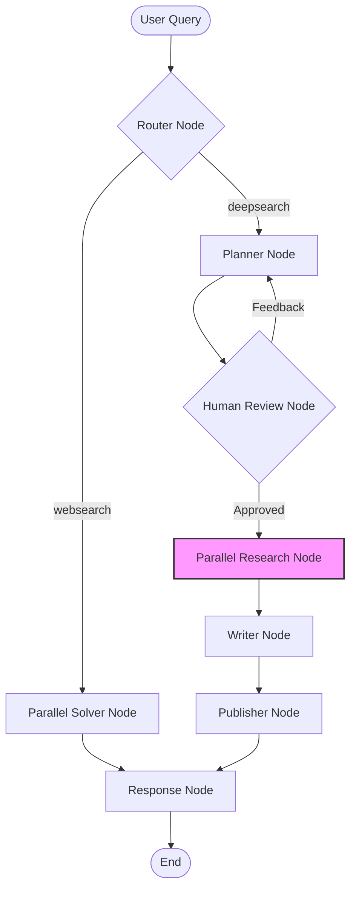
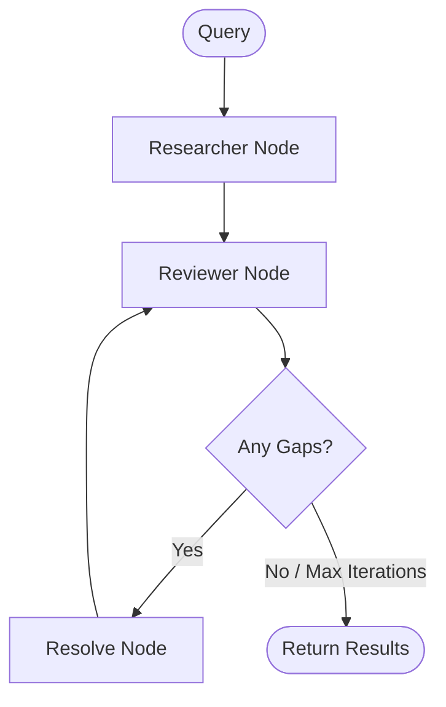

# 🔍 WORT - Complete Project Architecture

> A Full-Stack AI Research Agent: Research Planning → Execution → Report Generation

---

## 📋 Project Overview

**WORT** (Web Orchestrated Research Tool) is a high-performance, full-stack AI research platform. It leverages a **LangGraph-based agent** (`deep-research-agent`) to autonomously plan, research, and write comprehensive reports. The backend is powered by **FastAPI** with WebSocket capabilities for real-time streaming of agent thought processes and results to a **React (Vite)** frontend.

### Core Stack
- **Agent**: Python, LangGraph, LangChain, Tavily API, Google Gemini Pro
- **Backend**: FastAPI, WebSockets, PostgreSQL (Memory), Qdrant (Vector DB)
- **Frontend**: React, TypeScript, TanStack Query, Tailwind CSS, Shadcn/ui

---

## 📁 Complete File Structure & Explanations

### **Deep Research Agent** (`deep-research-agent/`)

*All agent logic, state management, and orchestration.*

*   **`deep_research_agent.py`**: Main entry point defining the primary LangGraph workflow, routing logic, and node orchestration (planner → research → writer).
*   **`graphs/states/subgraph_state.py`**: Defines `AgentGraphState` (main workflow state) and `ResearchReviewData` (subgraph state) using TypeDicts.
*   **`graphs/subgraphs/researcher_reviewer_subgraph.py`**: Implements the parallel research loop (researcher → reviewer → resolver) invoked by the main graph.
*   **`planner/plan.py`**: `Planner` class that uses LLMs to generate structured research plans based on user queries and memory context.
*   **`researcher/solution_tree/query_sol_ans.py`**: `Solver` class executing BFS-based research, handling web queries, content extraction, and answer synthesis.
*   **`reviewer/reviewer.py`**: `Reviewer` class that analyzes research findings to identify gaps and generate follow-up questions.
*   **`writer/report_writer.py`**: Orchestrates report generation, creating outlines and writing chapters in parallel using research data.
*   **`publisher/publisher.py`**: Formats the final report into Markdown/PDF, manages file saving, and potentially uploads to S3.
*   **`router/intent_router.py`**: Classifies user queries into modes (websearch, deepsearch, etc.) to determine the graph execution path.
*   **`response/response_composer.py`**: Formats the final agent response, combining report sections and metadata for frontend delivery.
*   **`memory/memory_facade.py`**: Unified interface for accessing both short-term (PostgreSQL) and long-term (Qdrant) memory systems.
*   **`streaming/stream_event.py`**: Defines the event schema and utilities for emitting real-time progress events to the frontend.
*   **`HITL/human_in_loop.py`**: Manages human-in-the-loop interactions, mainly pausing execution for plan approval/feedback.

### **Backend Server** (`server/`)

*FastAPI application handling HTTP and WebSocket connections.*

*   **`main.py`**: Application entry point. Initializes FastAPI, database connections, memory facade, and mounts routers and static files.
*   **`api/websocket.py`**: Manages WebSocket endpoints (`/ws/chat/{thread_id}`), delegating connection handling to `StreamService`.
*   **`api/routes.py`**: Defines HTTP REST endpoints, primarily for retrieving chat history and system health checks.
*   **`services/stream_service.py`**: Handles the WebSocket lifecycle: receiving messages, running the agent graph, and streaming events back to the client.
*   **`core/connection.py`**: `ConnectionManager` class that tracks active WebSocket connections and handles broadcasting/disconnection.

### **Frontend** (`FrontEnd/wort-ai-core/`)

*Modern React application for user interaction.*

*   **`src/App.tsx`**: Main application component setting up routing, providers (Query, Theme, Toaster), and layout structure.
*   **`src/pages/Index.tsx`**: The primary chat page layout, combining the sidebar, header, and main chat workspace.
*   **`src/components/ChatWorkspace.tsx`**: Core chat interface component. Manages message history, WebSocket connection status, and renders the chat stream.
*   **`src/components/ChatInput.tsx`**: User input component handling text entry and search mode selection (web, deep, extreme).
*   **`src/components/AgentProgress.tsx`**: Visualizes the progress of parallel research agents using meaningful progress bars and status text.
*   **`hooks/useChat.ts`**: Custom hook encapsulating WebSocket logic, state management (messages, logs), and connection handling.

---

## 🏗️ Core Architecture: LangGraph Nodes

### Main Agent Workflow

### The `parallel_research_node` Subgraph

The `parallel_research_node` is a critical component that enables **concurrency**. Instead of processing research queries sequentially, it spawns multiple instances of a subgraph—one for each query in the research plan.

**Logic Mechanism:**
1.  **Input**: Receives a list of `PlannerQuery` objects from the `Planner Node`.
2.  **Concurrency**: Uses `asyncio.gather` to invoke the `researcher_reviewer_subgraph` for every query simultaneously.
3.  **Accumulation**: As subgraphs complete, their results (`ResearchReviewData`) are collected and merged into the main state's `research_review` list.

**Subgraph Flow (Per Query):**

---

## 🧠 Core Logic & Functionality

*   **`router_node`**: Classifies intent (websearch/deepsearch) using LLM to route execution path.
*   **`planner_node`**: Generates a multi-step research plan + memory context retrieval for personalization.
*   **`parallel_research_node`**: Spawns concurrent subgraphs for each plan query using `asyncio` for speed.
*   **`writer_node`**: Synthesizes all research into a structured report (outline → chapters).
*   **`publisher_node`**: Formats final output (Markdown/PDF) and handles file I/O or S3 upload.
*   **`MemoryFacade`**: Unified API abstracting Postgres (chat history) and Qdrant (semantic knowledge).
*   **`AgentGraphState`**: TypedDict holding shared state (messages, plan, results, report) across nodes.
*   **FastAPI WebSocket**: bidirectional stream enabling real-time token, log, and state updates to frontend.

---

## ⚠️ Flaws, Missing Logic & Roadmap

### **Backend (FastAPI & Server)**
1.  **Error Recovery**: No global exception handler for graph failures; a crash in one node kills the connection.
2.  **Connection Leaks**: `ConnectionManager` lacks a heartbeat mechanism, potentially leaving dead connections open.
3.  **State Persistence**: While `MemorySaver` exists, server restarts wipe in-memory graph states if not backed by Redis/DB.
4.  **Streaming Noise**: Examples of `StreamService` emit too many raw events; needs filtering/batching to reduce frontend load.

### **LangGraph & Agent**
1.  **Infinite Loops**: The `reviewer_node` logic relies on `MAX_ITERATIONS` but lacks semantic convergence checks (stopping if answers don't improve).
2.  **Duplicate Research**: No deduplication of queries across parallel branches; multiple agents might research the same topic.
3.  **Context limitation**: `parallel_research_node` subgraphs don't share findings with each other *during* execution, only after merging.
4.  **Integration**: `human_review_node` interrupt logic is implemented in the graph but **NOT** fully wired to the WebSocket/Frontend for interactive approval.

### **Frontend & User Experience**
1.  **Offline Support**: No local storage sync; reloading the page kills the WebSocket connection and loses ephemeral progress.
2.  **Rendering**: Large reports cause layout shifts; markdown rendering needs optimization (virtualization).
3.  **Missing Features**: "Stop/Cancel" button to abort long-running research not implemented.

### **FastAPI & Streaming Missing Logic (< 100 words)**
To truly robustify the system, the **Streaming Logic** needs:
1.  **Backpressure & Batching**: Buffer tokens (50ms window) before sending to prevent frontend jitter.
2.  **Heartbeat/Ping-Pong**: Automatically detect and close stale connections.
3.  **Reconnection Strategy**: Allow clients to reconnect with a `thread_id` and receive the *current* execution state instead of restarting.
4.  **Error Boundaries**: Wrap graph execution in `try/except` blocks that emit proper `error` events to the UI instead of silent failures.
5.  **Structured Logs**: Replace raw string logs with structured events (`{step, status, duration}`) for better UI visualization.
