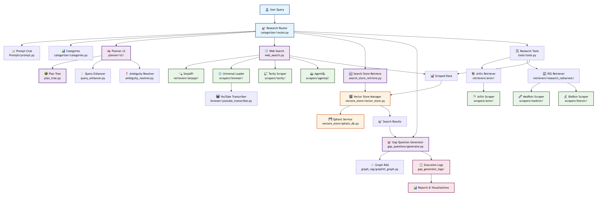
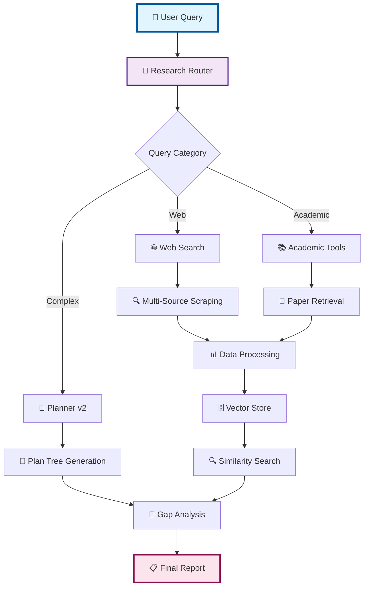

# 🔍 Deep Research Agent - Architecture Documentation

[](LICENSE)
[](https://python.org)
[]()


## 🏗️ System Architecture



*The complete system workflow showing all components and their interactions*

### 🔄 Core Components

| Component | Description | Location |
|-----------|-------------|----------|
| **Research Router** | Query categorization and routing | `categorizer/router.py` |
| **Planner v2** | Advanced research planning with dependency trees | `planner/v2/` |
| **Web Search Engine** | Multi-source web scraping and retrieval | `web_search.py` |
| **Academic Tools** | ArXiv, MedRxiv, BioRxiv integration | `tools/tools.py` |
| **Vector Store** | Qdrant-based similarity search | `vectore_store/` |
| **Gap Generator** | Intelligent follow-up question generation | `gap_questions/` |

---

## 🚀 Search Modes

### 🌐 WebSearch Mode
**Quick web-based research for immediate answers**

- Uses SerpAPI for search results
- Multiple scraper integration (Tavily, AgentQL, Browser)
- Fast response time
- Ideal for: Current events, quick facts, general queries

### 🔬 DeepSearch Mode
**Comprehensive research combining multiple sources**

- Web search + Academic sources
- Vector store integration for context
- Enhanced query processing
- Ideal for: Research projects, detailed analysis, academic work

### ⚡ ExtremeSearch Mode
**Full-pipeline research with advanced AI techniques**

- Complete dependency-driven research
- Graph RAG integration
- Ambiguity resolution
- Gap question generation
- Ideal for: Complex research, thesis work, comprehensive reports

---

## 📊 Data Flow Architecture



---

## 🏗️ Component Structure

### 📁 Project Organization

```
deep-research-agent/
├── 📊 categorizer/           # Query routing and categorization
│   ├── router.py            # Main routing logic
│   └── categories.py        # Category definitions
├── 🔬 Researcher/           # Core research components
│   ├── scrapers/           # Data collection modules
│   │   ├── browser/        # Web browser automation
│   │   ├── tavily/         # Tavily API integration
│   │   ├── agentql/        # AgentQL scraping
│   │   ├── arxiv/          # ArXiv paper scraping
│   │   ├── medrxiv/        # MedRxiv integration
│   │   └── biorxiv/        # BioRxiv integration
│   ├── retrievers/         # Search and retrieval
│   │   ├── serpapi/        # Google Search API
│   │   ├── arxiv/          # ArXiv API
│   │   └── research_rssharvest/ # RSS feed processing
│   ├── vectore_store/      # Vector database
│   │   ├── vector_store.py # Vector operations
│   │   └── qdrant_db.py    # Qdrant integration
│   ├── planner/            # Research planning
│   │   ├── v1/             # Legacy planner
│   │   └── v2/             # Advanced planner
│   │       ├── plan_tree.py        # Dependency trees
│   │       ├── query_enhancer.py   # Query optimization
│   │       └── ambiguity_resolver.py # Ambiguity handling
│   ├── gap_questions/      # Gap analysis
│   │   └── generator.py    # Question generation
│   ├── graph_rag/          # Graph RAG implementation
│   └── tools/              # Research utilities
└── 📝 Prompts/             # LLM prompt management
```

---

## 🔧 Technical Implementation

### 🧠 Planning System

The **Planner v2** system creates intelligent research strategies:

- **Plan Tree**: Builds dependency-driven question hierarchies
- **Query Enhancer**: Optimizes search queries for better results
- **Ambiguity Resolver**: Clarifies unclear or ambiguous queries
- **Dependency Management**: Ensures logical research flow

### 🗄️ Vector Store Integration

**Qdrant-powered similarity search**:

```python
# Example vector store workflow
scraped_data → vector_embedding → qdrant_storage → similarity_search → relevant_context
```

### 🎯 Gap Question Generation

Advanced AI system that:
- Identifies knowledge gaps in research
- Generates intelligent follow-up questions
- Uses LangGraph for orchestration
- Provides comprehensive logging and visualization

---

## 🚦 Getting Started

### Prerequisites

- Python 3.8+
- Qdrant database
- API keys for external services (SerpAPI, etc.)

### Quick Start

1. **Clone the repository**
   ```bash
   git clone https://github.com/your-repo/deep-research-agent.git
   cd deep-research-agent
   ```

2. **Install dependencies**
   ```bash
   pip install -r requirements.txt
   ```

3. **Configure environment**
   ```bash
   # Set up your API keys and configuration
   cp .env.example .env
   ```

4. **Run a simple search**
   ```python
   from researcher.web_search import WebSearch
   
   # Quick web search
   results = WebSearch().search("AI research trends 2024")
   ```

---

## 📈 Performance & Scalability

| Mode | Response Time | Sources | Accuracy | Use Case |
|------|---------------|---------|----------|----------|
| WebSearch | ~30 seconds | 5-10 | Good | Quick queries |
| DeepSearch | ~2-5 minutes | 15-25 | High | Research projects |
| ExtremeSearch | ~5-15 minutes | 25+ | Excellent | Comprehensive analysis |

---

## 🤝 Contributing

We welcome contributions! Please see our [Contributing Guidelines](CONTRIBUTING.md) for details.

### Development Setup

1. Fork the repository
2. Create a feature branch
3. Make your changes
4. Add tests
5. Submit a pull request

---

## 📄 License

This project is licensed under the MIT License - see the [LICENSE](LICENSE) file for details.

---

## 🔗 Links


- [Issues](https://github.com/your-repo/deep-research-agent/issues)

---

*Built By WORT TEAM*