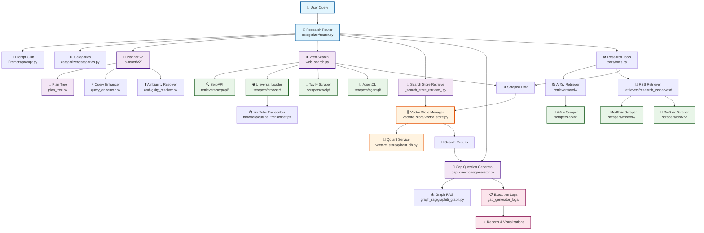
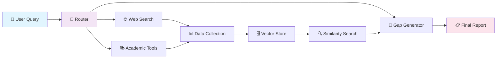
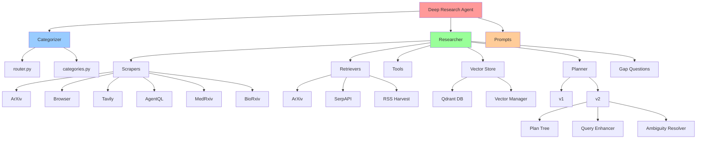

# 🔍 Deep Research Agent - Architecture Diagram

```mermaid
graph TB
    %% Entry Points
    USER[👤 User Query] --> ROUTER[🎯 Research Router<br/>categorizer/router.py]
    
    %% Core Categorization
    ROUTER --> PROMPT[📝 Prompt Club<br/>Prompts/prompt.py]
    ROUTER --> CATEGORIES[📊 Categories<br/>categorizer/categories.py]
    
    %% Planning Layer
    ROUTER --> PLANNER_V2[🧠 Planner v2<br/>planner/v2/]
    PLANNER_V2 --> PLAN_TREE[🌳 Plan Tree<br/>plan_tree.py]
    PLANNER_V2 --> QUERY_ENHANCER[⚡ Query Enhancer<br/>query_enhancer.py]
    PLANNER_V2 --> AMBIGUITY[❓ Ambiguity Resolver<br/>ambiguity_resolver.py]
    
    %% Main Research Workflows
    ROUTER --> WEB_SEARCH[🌐 Web Search<br/>web_search.py]
    ROUTER --> SEARCH_STORE[🔄 Search Store Retrieve<br/>_search_store_retrieve_.py]
    ROUTER --> GAP_GEN[🎯 Gap Question Generator<br/>gap_questions/generator.py]
    
    %% Web Search Components
    WEB_SEARCH --> SERPAPI[🔍 SerpAPI<br/>retrievers/serpapi/]
    WEB_SEARCH --> BROWSER[🌐 Universal Loader<br/>scrapers/browser/]
    WEB_SEARCH --> TAVILY[📡 Tavily Scraper<br/>scrapers/tavily/]
    WEB_SEARCH --> AGENTQL[🤖 AgentQL<br/>scrapers/agentql/]
    
    %% Academic Research Tools
    ROUTER --> TOOLS[🛠️ Research Tools<br/>tools/tools.py]
    TOOLS --> ARXIV_RET[📚 ArXiv Retriever<br/>retrievers/arxiv/]
    TOOLS --> RSS_RET[📰 RSS Retriever<br/>retrievers/research_rssharvest/]
    ARXIV_RET --> ARXIV_SCRAPER[📄 ArXiv Scraper<br/>scrapers/arxiv/]
    RSS_RET --> MEDRXIV_SCRAPER[🧬 MedRxiv Scraper<br/>scrapers/medrxiv/]
    RSS_RET --> BIORXIV_SCRAPER[🔬 BioRxiv Scraper<br/>scrapers/biorxiv/]
    
    %% Vector Store System
    SEARCH_STORE --> VECTOR_MGR[🗄️ Vector Store Manager<br/>vectore_store/vector_store.py]
    VECTOR_MGR --> QDRANT[💾 Qdrant Service<br/>vectore_store/qdrant_db.py]
    
    %% YouTube Processing
    BROWSER --> YOUTUBE[📺 YouTube Transcriber<br/>browser/youtube_transcriber.py]
    
    %% Graph RAG (Advanced)
    GAP_GEN --> GRAPH_RAG[🕸️ Graph RAG<br/>graph_rag/graphiti_graph.py]
    
    %% Data Flow
    WEB_SEARCH --> DATA_FLOW[📊 Scraped Data]
    TOOLS --> DATA_FLOW
    DATA_FLOW --> VECTOR_MGR
    VECTOR_MGR --> SEARCH_RESULTS[🎯 Search Results]
    SEARCH_RESULTS --> GAP_GEN
    
    %% Output Generation
    GAP_GEN --> LOGS[📋 Execution Logs<br/>gap_generator_logs/]
    LOGS --> REPORTS[📊 Reports & Visualizations]
    
    %% Styling
    classDef entry fill:#e1f5fe,stroke:#01579b,stroke-width:2px
    classDef core fill:#f3e5f5,stroke:#4a148c,stroke-width:2px
    classDef scraper fill:#e8f5e8,stroke:#1b5e20,stroke-width:2px
    classDef storage fill:#fff3e0,stroke:#e65100,stroke-width:2px
    classDef output fill:#fce4ec,stroke:#880e4f,stroke-width:2px
    
    class USER,ROUTER entry
    class PLANNER_V2,PLAN_TREE,WEB_SEARCH,SEARCH_STORE,GAP_GEN core
    class SERPAPI,BROWSER,TAVILY,AGENTQL,ARXIV_SCRAPER,MEDRXIV_SCRAPER,BIORXIV_SCRAPER scraper
    class VECTOR_MGR,QDRANT storage
    class LOGS,REPORTS output
```

## 📊 Simplified Data Flow Diagram

```mermaid
flowchart LR
    A[👤 User Query] --> B[🎯 Router]
    B --> C[🌐 Web Search]
    B --> D[📚 Academic Tools]
    B --> E[🧠 Gap Generator]
    
    C --> F[📊 Data Collection]
    D --> F
    
    F --> G[🗄️ Vector Store]
    G --> H[🔍 Similarity Search]
    H --> E
    
    E --> I[📋 Final Report]
    
    style A fill:#e1f5fe
    style B fill:#f3e5f5
    style I fill:#fce4ec
```

## 🏗️ Component Hierarchy

```mermaid
graph TD
    ROOT[Deep Research Agent]
    
    ROOT --> CAT[Categorizer]
    ROOT --> RES[Researcher]
    ROOT --> PROM[Prompts]
    
    CAT --> ROUTER[router.py]
    CAT --> CATEGORIES[categories.py]
    
    RES --> SCRAPERS[Scrapers]
    RES --> RETRIEVERS[Retrievers]
    RES --> TOOLS[Tools]
    RES --> VECTOR[Vector Store]
    RES --> PLANNER[Planner]
    RES --> GAP[Gap Questions]
    
    SCRAPERS --> ARXIV_S[ArXiv]
    SCRAPERS --> BROWSER_S[Browser]
    SCRAPERS --> TAVILY_S[Tavily]
    SCRAPERS --> AGENTQL_S[AgentQL]
    SCRAPERS --> MEDRXIV_S[MedRxiv]
    SCRAPERS --> BIORXIV_S[BioRxiv]
    
    RETRIEVERS --> ARXIV_R[ArXiv]
    RETRIEVERS --> SERPAPI_R[SerpAPI]
    RETRIEVERS --> RSS_R[RSS Harvest]
    
    VECTOR --> QDRANT_V[Qdrant DB]
    VECTOR --> MANAGER_V[Vector Manager]
    
    PLANNER --> V1[v1]
    PLANNER --> V2[v2]
    
    V2 --> PLAN_TREE[Plan Tree]
    V2 --> QUERY_ENH[Query Enhancer]
    V2 --> AMBIGUITY[Ambiguity Resolver]
    
    style ROOT fill:#ff9999
    style CAT fill:#99ccff
    style RES fill:#99ff99
    style PROM fill:#ffcc99
```